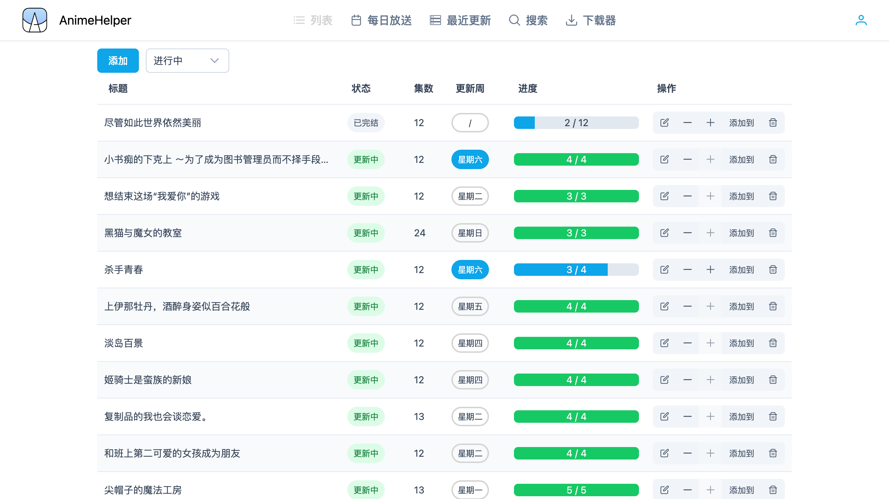
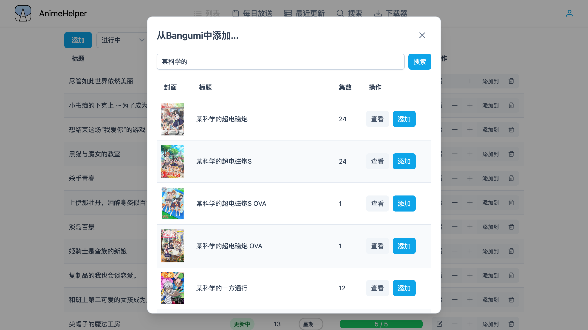
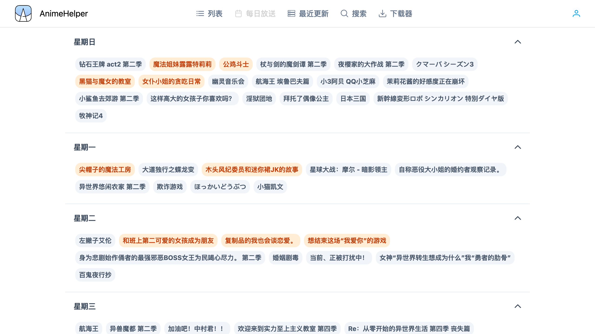
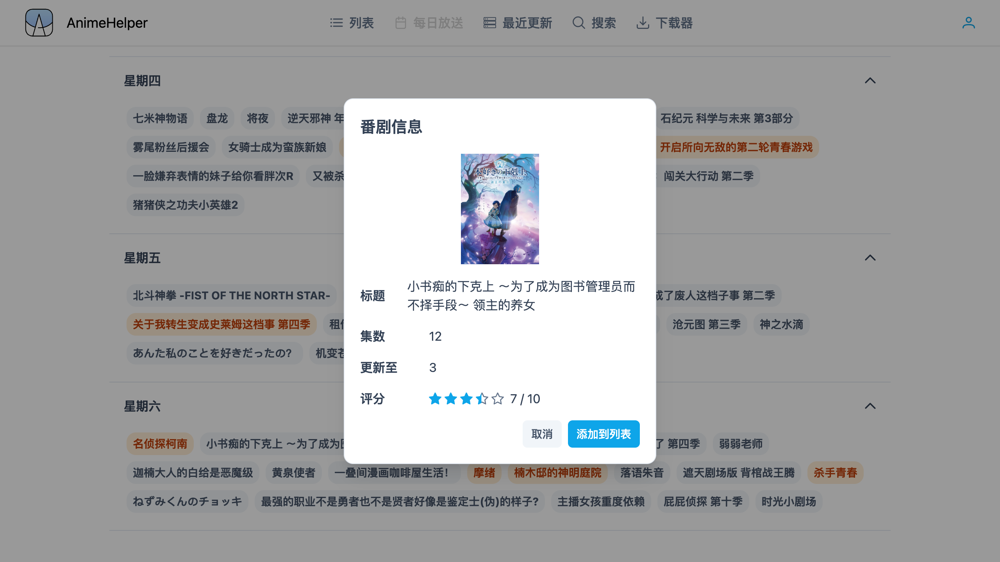
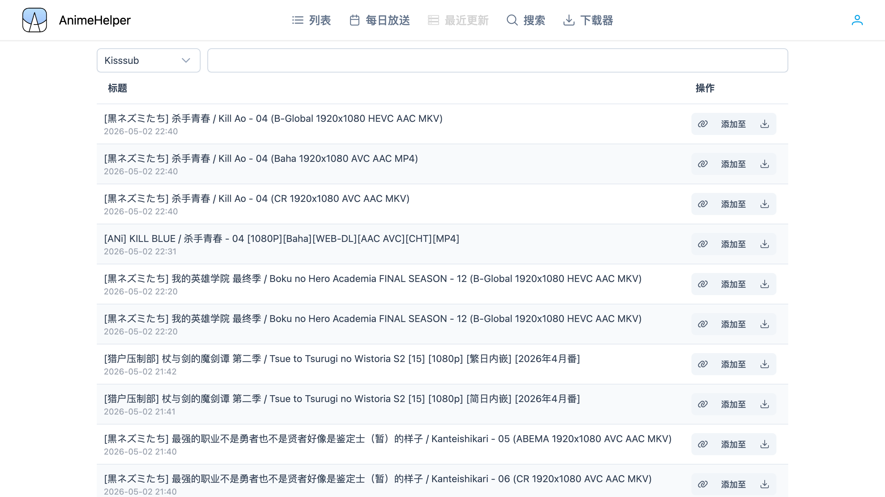
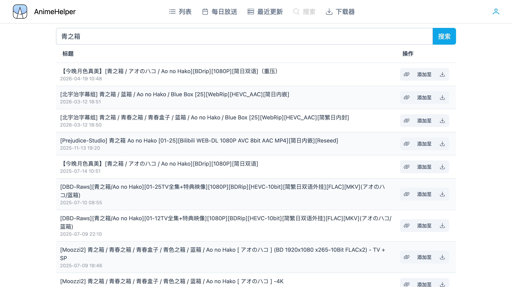
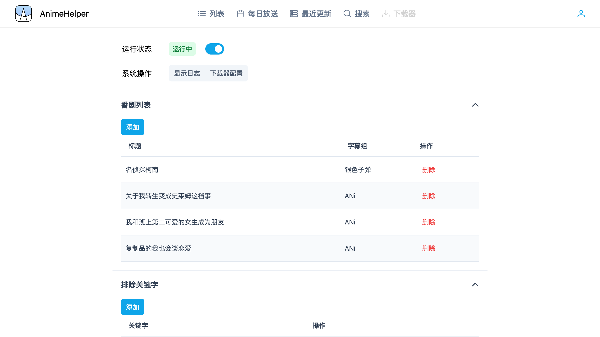
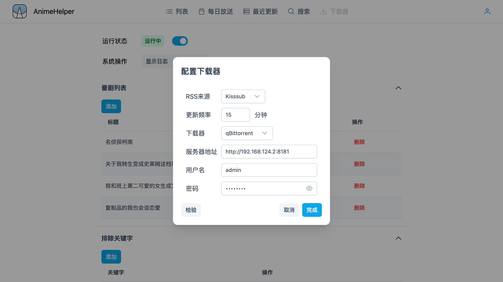

# Anime Helper

</img>


这个项目由ElysiaJS和Vue开发  
前端页面的仓库[在这里](https://github.com/Zhoucheng133/Anime-Helper-UI)

> [!NOTE]
> 由于Bangumi API被墙，本项目使用CloudFlare进行代理，每日10万次请求限制  
> 如果你有能力建议自行使用CloudFlare进行代理，Worker配置在`cf/index.js`

## 目录
- [功能](#功能)
- [截图](#截图)
- [快速开始](#快速开始)
  - [部署](#部署)
  - [更新](#更新)
- [手动部署](#手动部署)
- [下载器配置](#下载器配置)
- [一些API](#一些api)
- [赞助](#赞助)

## 功能

✅ 已支持深色模式

### 列表
- 手动添加已完结的番剧，并且可以编辑观看进度
- 手动添加更新中的番剧，你需要添加更新周和已更新的集数，自动计算已经更新的集数
- 通过Bangmi搜索查看番剧信息
- 从Bangumi中搜索标题自动添加
- 你也可以从`每日放送`页面中自动添加更新中的番剧
- 筛选番剧列表，分类方式有`所有`, `进行中`(没看完的), `更新中`, `已完结`, `已看完`, `搜索`和`更新周`

### 每日放送
- 通过Bangumi API获取每周更新的番剧
- 点击番剧可以查看番剧信息和自动添加到`列表`中

### 最近更新
- 显示最近更新的番剧（你可以选择来源是`蜜柑计划`或者`Kisssub`）
- 复制磁力链接或者种子链接
- 自动添加到`下载器`的番剧列表中
- 直接下载 **(需要配置下载器)**

### 搜索
- 搜索番剧 (受限于Kisssub的RSS限制，显示的结果不一定完整)
- 和`最近更新`一样，你可以复制磁力链接或者种子链接、添加到`下载器`的番剧列表中或者直接下载

### 下载器
- 将正在更新的番剧添加到番剧列表中（需要你填写字幕组和番剧名称），监听`蜜柑计划`或`Kisssub`的RSS列表，匹配的会自动下载
- 支持`Aria2`、`qBitorrent`和`Transmission`下载器
- 支持自定义更新频率（为保护RSS服务，最低频率为10分钟）
- 支持添加排除关键字（比如遇到`720P`关键词不会下载）

## 截图

### 列表




### 每日放送




### 最近更新



### 搜索



### 下载器




## 快速开始

### 部署

本项目需要使用Docker进行配置

> [!NOTE]
> 你需要修改下面命令中带有尖括号的内容（包括尖括号本身）

```bash
sudo docker run -d \
--restart always \
--name anime-helper \
-p <主机端口>:3000 \
-v <主机上存储数据库的位置*>:/app/db \
zhouc1230/anime-helper:latest
```

*任意，保证存在并且可以读写的目录即可

> [!IMPORTANT]
> 如果你使用Kisssub作为RSS源，会自动将获取到的列表翻译成简体中文，因此请以`最近更新`或者`搜索`页面的结果为准

### 更新

> [!NOTE]
> 更新后会停止下载器监听RSS，更新后请重新启动下载器

```bash
# 拉取最新镜像
docker pull zhouc1230/anime-helper:latest
# 停止旧容器
docker stop anime-helper
# 删除旧容器
docker rm anime-helper
# 启动新容器
sudo docker run -d \
--restart always \
--name anime-helper \
-p <主机端口>:3000 \
-v <主机上存储数据库的位置>:/app/db \
zhouc1230/anime-helper:latest
```

## 手动部署

若要手动在Docker上部署，你需要手动克隆仓库，并且获取子模块

```bash
git clone --recursive https://github.com/Zhoucheng133/Anime-Helper.git
cd Anime-Helper
```

生成镜像：`sudo docker build -t helper <文件夹目录>`

```bash
sudo docker run -d \
--restart always \
-p <主机端口>:3000 \
-v <主机上存储数据库的位置>:/app/db \
--name helper helper
```

## 下载器配置

### 在Docker上部署Aria服务

你需要在搭建设备局域网内（或者就在该设备上）有Aria2服务，详细你可以[查看这里](https://github.com/P3TERX/Aria2-Pro-Docker)。如果你通过该文档安装了Aria2，那么默认的Aria2地址为`http://<ip>:16800/jsonrpc`，密码在你通过Docker安装的时候作为参数写入

### 在Docker上部署qBitorrent服务
你可以在Docker上部署qBitorrent服务，详细你可以[查看这里](https://hub.docker.com/r/linuxserver/qbittorrent)

### 使用Motrix下载器 (不推荐)
你也可以通过[Motrix](https://motrix.app/zh-CN)作为Aria下载器，其下载端口和密码在该软件的设置中

## 重置用户

如果你忘记了用户名密码，可以这样重置登录用户

### 在你的设备上操作
1. 停止容器 `sudo docker stop anime-helper`
2. 下载数据库文件`<存储数据库的位置>/database.db`，建议先备份数据库
3. 使用支持sqlite3的工具，删除user表的数据
4. 将修改好的数据库文件复制回`<存储数据库的位置>/database.db`，替代原有的文件
5. 启动容器 `sudo docker start anime-helper`

### 直接在服务器上操作
1. 停止容器 `sudo docker stop anime-helper`
2. 在`存储数据库的位置`上，建议先备份数据库
   ```bash
   cp database.db database.db.bak
   ```
3. 使用这个命令删除user表:
   ```bash
   sqlite3 data.db
   DELETE FROM user;
   .quit
   ```
4. 重新启动容器 `sudo docker start anime-helper`

## 一些API

[Bangumi API](https://bangumi.github.io/api/)

[Mikan RSS](https://mikanime.tv/RSS/Classic)

[Kisssub RSS](https://kisssub.org/rss.xml)

## 赞助

如果有帮助到了你，欢迎[给我投喂](https://blog.z-server.top/sponsor/)谢谢 🙏  